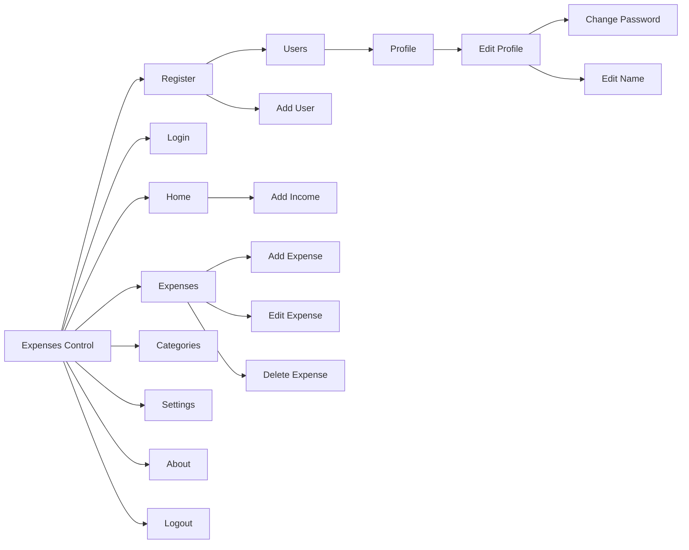

# Expenses-Control

```mermaid
graph LR
A[Expenses Control] --> D[Register] --> G[Users] --> I[Profile] --> M[Edit Profile] --> N[Change Password]
A --> E[Login]
A --> H[Home]
A --> B[Expenses]
A --> C[Categories]
A --> J[Settings]
A --> K[About]
A --> F[Logout]
B --> P[Add Expense]
B --> Q[Edit Expense]
B --> R[Delete Expense]
D --> L[Add User]
H --> S[Add Income]
M --> O[Edit Name]
```